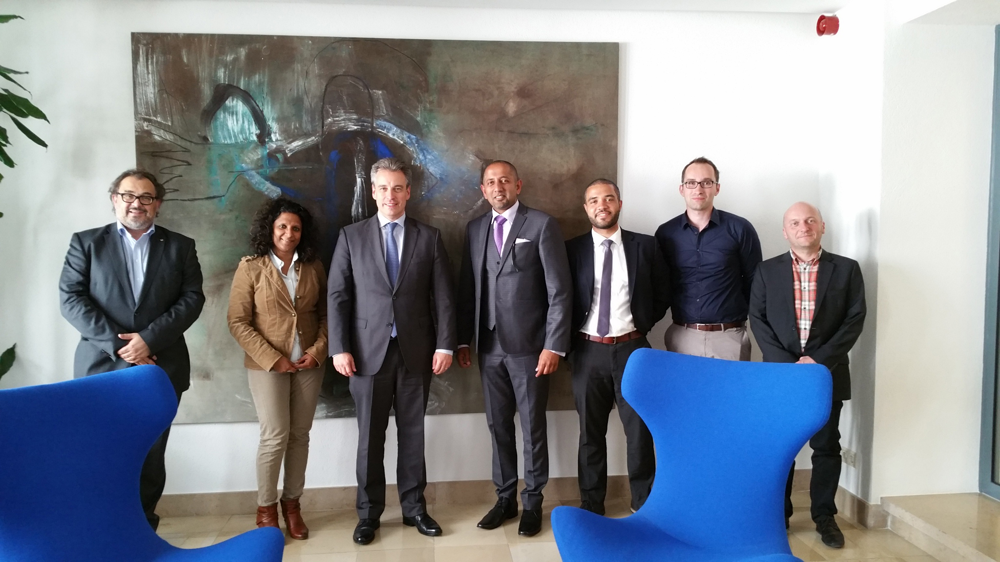
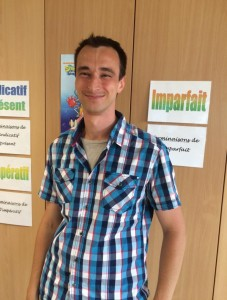
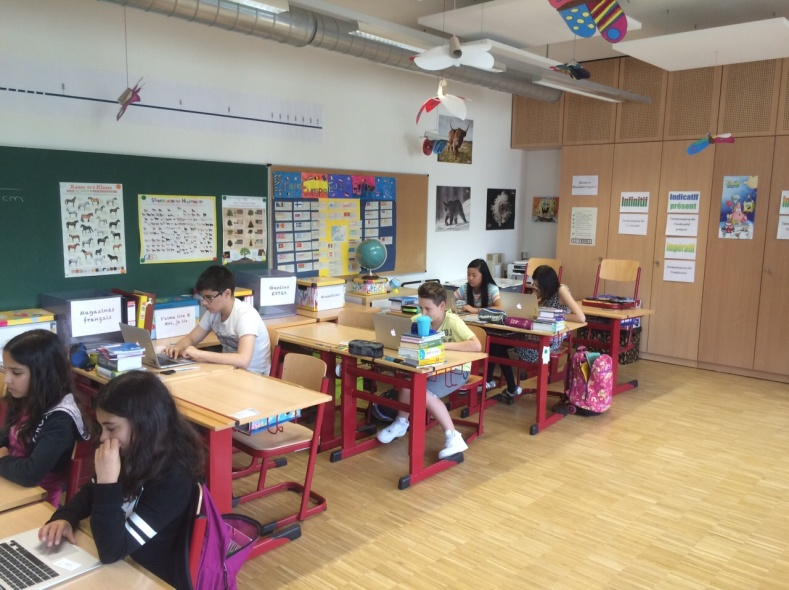
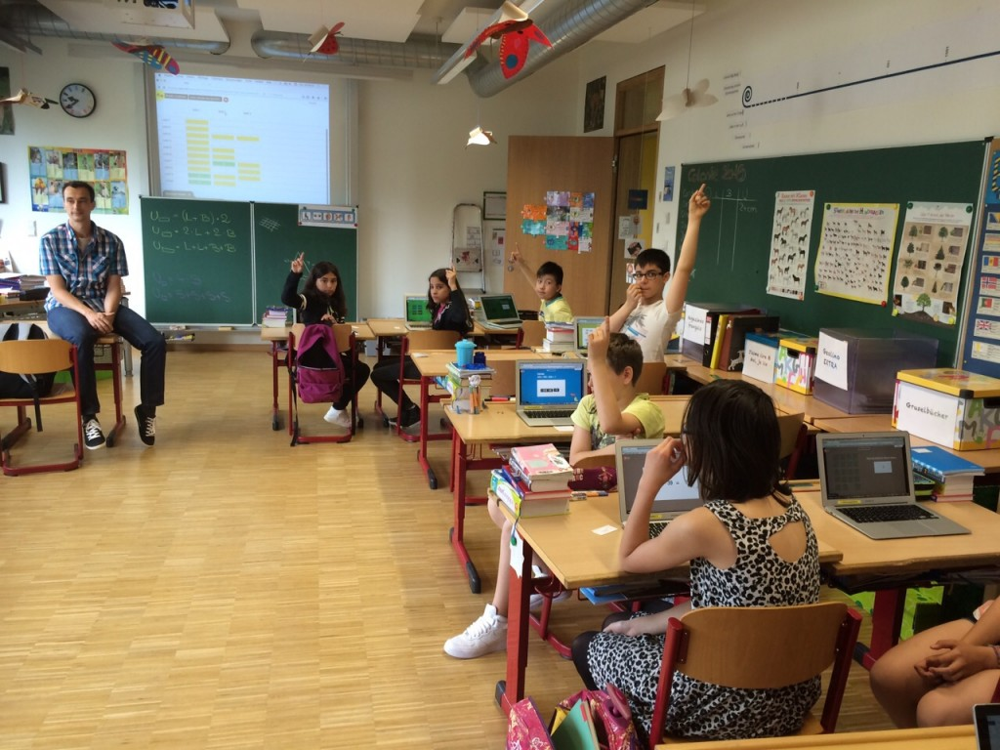
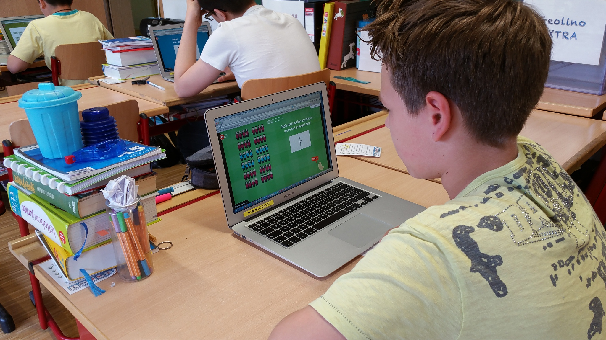
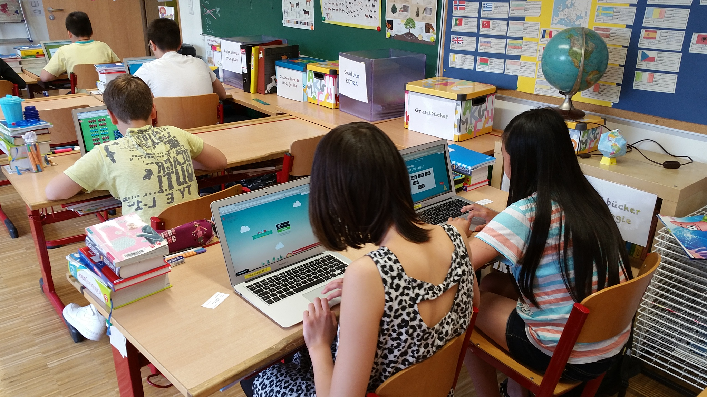

Luxembourg is investing in digital learning, as part of the government’s Digital Luxembourg strategy, announced by Prime Minister Xavier Bettel and under the leadership and guidance of Minister Claude Meisch – Minister of National Education, Children and Youth, Grand Duchy of Luxembourg.

In its desire to foster students’ success, learning and engagement, MENJE has signed an agreement with Vretta Inc. to develop and deliver a personalized learning environment that will provide students with an opportunity to learn mathematics in an engaging and intuitive way. This digital learning environment is called MathemaTIC.

MathemaTIC is being developed with teachers and researchers from the Grand Duchy of Luxembourg, France, the University of Luxembourg, and Vretta. Students will have access to MathemaTIC 24/7 on any mobile device, including computers, laptops, tablets, and smartphones, at school and at home.

MathemaTIC will be phased into schools beginning in September, 2015. Students will receive access to digital tools designed to identify and strengthen areas of individual weakness in mathematics. Parents and educators will benefit from real-time data, tracking students’ learning progress, and providing a snapshot of their ability to succeed in achieving critical learning outcomes for their school year in mathematics.

## Quick Facts

- MathemaTIC is available in French, German, English, and Portuguese and is tailored to the curriculum.
- Over 1,200 Grade 5/6 (Cycle 4) primary school students in 70 classes from 25 schools participated in the pilot testing of MathemaTIC.

MathemaTIC at l’école fondamentale à Beggen

“We have started trying out MathemaTIC at our school for Cycle 4 students. It is definitely motivating for my students and they seem to like it much more than working from a traditional textbook. The mathematical items are visual and they keep my students engaged. Students also have access to continuous online help, if they need it.

What I like the most about MathemaTIC that it is adapted to each of my students learning levels and keeps raising the bar as they are working through the items. I have also noticed that my students are spending more time practicing mathematics now. They seem to be enjoying the learning experience and I hope that MathemaTIC will soon be made available for all of the higher grades too.

Most of our textbooks are in German language, as we get them from Germany. This makes it difficult for parents to be able to help students as most of them don’t know German. It is great that this system is available for students in French, German, and Portuguese.

Students have not used anything like this for any other subjects. They are happy to realize that their computers can not only be used to listen to music, play games, and Google search, but also to learn Mathematics in a fun and engaging way!”

“I like being on my computer a lot and I have completed the first unit already. I enjoy working with this math system.”
– Odo Chiu, Student

“I think this is really cool and I surely prefer this to a textbook because there is less to write!”
– Sara Ferreira, Student

“It does not feel like homework at all. It feels like I am playing and learning math.”
– David Patricio, Student

“It is very easy to access and use the different tools. I like the designs used and the way the calculations have been presented.”
– Loec Estveves, Student
