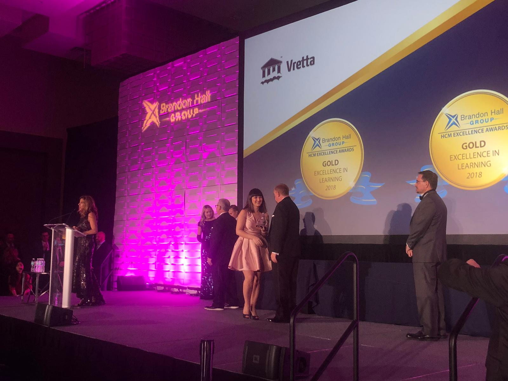
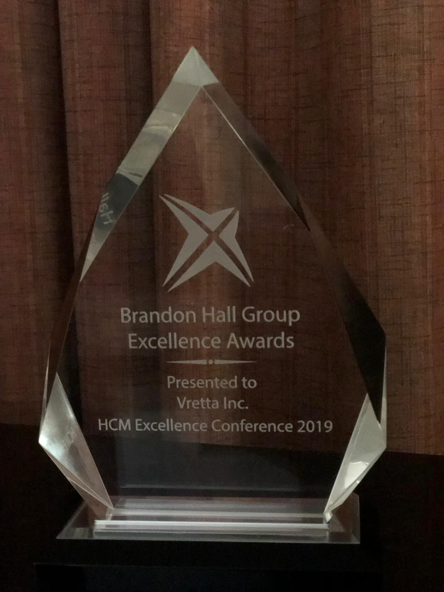
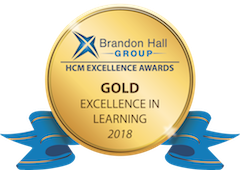

[Vretta](http://www.vretta.com/) and [SCRIPT](https://portal.education.lu/script/), Luxembourg Ministry of Education, received the coveted Gold Award from the Brandon Hall Group for [MathemaTIC](http://mathematic.lu/mathmatic_blog/post_10/www.mathematic.org) in the category Best Advance in Custom Content for the successful implementation and progress towards raising attainment and reducing the equity gap at primary and secondary schools in Luxembourg.

The Brandon Hall Group Excellence Awards Program is the most prestigious awards program in the learning industry around the world. Often times called the “Academy Awards” in the learning industry, this Excellence Award recognizes the best organizations that have successfully deployed programs, strategies, modalities, processes, systems, and tools that have achieved measurable results.

Gold Learning Award 2018 The award entries were evaluated by a panel of veteran, independent industry experts and senior analysts based on the following criteria: fit the need, design of the programme, functionality, innovation, and overall measurable benefits.

“Winning an Excellence Award is a great honour, but the real winners are the organizations themselves and their customers and clients because of the innovation and customer focus they demonstrate” said Rachel Cooke, Chief Operating Officer of Brandon Hall Group and head of the awards program.

<!--  -->

As a pillar of the Digital (4) Education strategy established by the Luxembourg Ministry of Education as part of the “Digital Lëtzebuerg” initiative, MathemaTIC was created to provide all learners with access to high quality pedagogical resources to enjoy learning mathematics and to have the opportunity to participate using innovative ICT tools to acquire 21st Century skills.

To learn more about the MathemaTIC project, email us at [info@mathmatic.org](mailto:info@mathmatic.org).

## ABOUT THE BRANDON HALL GROUP

With 25 years of delivering world class research and advisory services, Brandon Hall Group is the most well-known and established research organization in the performance improvement industry. The organization conducts research that drives performance, and provides strategic insights for organizations responsible for growth and results.
