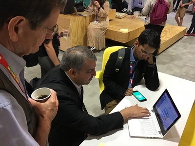

Vretta and the Luxembourg Ministry of Education won the App-Based Game Group Award during the 6th International Educational Games Competition at the European Conference on Games-Based Learning for MathemaTIC.

The International Educational Games Competitions ([IEGC](https://www.academic-conferences.org/conferences/ecgbl/ecgbl-international-educational-games-competition/)) takes place during the annual European Conference on Games-Based Learning ([ECGBL](https://www.academic-conferences.org/conferences/ecgbl/)) and showcases the most engaging, immersive, and impactful game-based educational resources from around the world. This year, 60 entries from more than 40 countries participated in the competition and had their game-based applications assessed and evaluated by their peers in the educational gaming community.

[MathemaTIC](http://mathematic.org/), was awarded the App-Based Game Group Award for the immersive design of its engaging lessons and game-based items, as well as the positive impact that the implementation of the MathemaTIC platform throughout Luxembourg has had on student success in mathematics.

This recognition marks the third prestigious award that MathemaTIC has received over the last 5 months. As MathemaTIC continues to grow and receive appreciation for its personalized learning environment and immersive digital items, the importance of providing students with a digital platform that adapts to their individual learning needs and makes mastering mathematics fun and engaging is becoming increasingly apparent.

To give your students access to MathemaTIC’s award-winning game-based items and personalized environment for mathematics, click [here](info@mathmatic.org).

About the International Education Games Competition (ECGBL)
The International Education Games Competition is hosted annually at the European Conference on Games-Based Learning. Entrants who have been accepted to participate in this competition are those who have submitted the most innovative and immersive game-based educational platforms from around the world. The aims of the competition are to provide an opportunity for educational game designers and creators to demonstrate their game design and development on an international stage, to give Game-Based Learning creators the opportunity to have their games peer-assessed and peer-evaluated, and to provide ECGBL attendees with access to engaging and best-practice games that showcase exemplary applications of Game-Based Learning.

About the MathemaTIC Project
MathemaTIC is a pillar of the Digital (4) Education strategy established by the Luxembourg Ministry of Education as part of the "Digital Lëtzebuerg" initiative within with the framework of the goals set by the European Union Horizon 2020 research and innovation programme to promote digital awareness among its citizens. The strategy was to provide all learners, irrespective of their social origin, access to quality information and pedagogical resources. The development of MathemaTIC included partners from [SCRIPT](https://portal.education.lu/script/), [Vretta](http://www.vretta.com/), the [French Ministry of Education](http://www.education.gouv.fr/), the [University of Luxembourg](https://wwwen.uni.lu/), the [Luxembourg Centre for Education Testing](https://wwwen.uni.lu/recherche/.../luxembourg_centre_for_educational_testing_lucet), the [Luxembourg Institute of Socio-Economic Research](https://www.liser.lu/), and the [Centre de gestion informatique de l'éducation](http://portal.education.lu/cgie).
