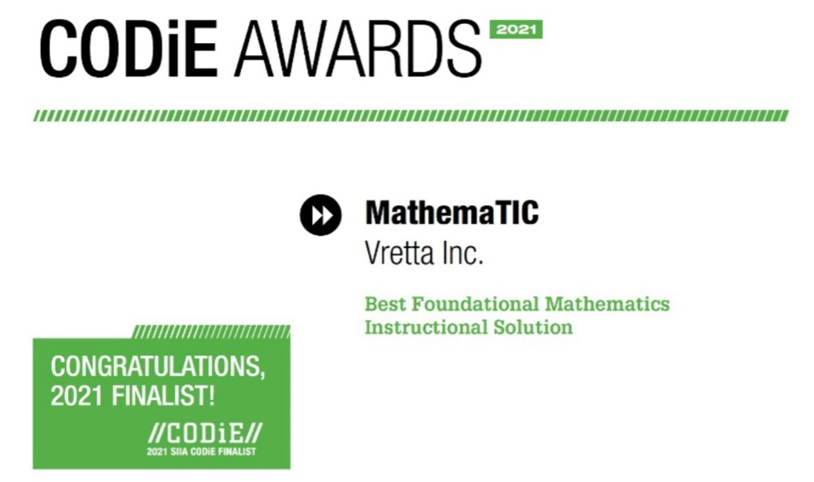

Vretta, the technology partner for [MathemaTIC](https://mathematic.lu/), today announced that MathemaTIC was named a 2021 [SIIA CODiE Award](https://history.siia.net/codie) finalist in the Best Foundational Mathematics Instructional Solution category. CODiE Award finalists represent applications, products and services from developers of educational software, digital content, online learning services and related technologies across the PreK-20 sector.

MathemaTIC is a personalized learning platform designed to provide students in Grades 3 to 10 with an engaging, real-world learning and assessment experience to strengthen their skills in mathematics. MathemaTIC was developed over five years through an international collaboration between [SCRIPT](https://www.script.lu/en/script/a-propos) at the Luxembourg Ministry of Education and [Vretta](https://www.vretta.com/), along with other educational research partners in Luxembourg and France.

One of the 2021 CODiE Award reviewers mentioned “[MathemaTIC](https://mathematic.lu/). provides an answer for digital instruction in mathematics for the diverse student population. Customized series of formative and summative assessments guide the user on a personalized path with instructional and real-life learning models. The overall appeal to this program is its ability to provide material in multiple languages seamlessly. The teacher has the flexibility of adjusting the range and depth of material to align with class instruction while the student can continue on their own path.”

Acknowledged as the premier awards program for the software and information industries for over 35 years, the SIIA CODiE Awards are produced by the Software & Information Industry Association (SIIA), the principal trade association for the software, education, media, financial information and digital content industries. MathemaTIC was honored as one of 152 finalists across the 42 education technology categories.

“The CODiE Awards recognize the most exciting and transformative products in Ed Tech,” said Jeff Joseph, SIIA President. “This year, these leaders helped our nation respond to the historic pandemic, enabling learners, educators, administrators and parents to remain connected to each other and to critical educational resources via an array of innovative services and platforms. Congratulations to this year’s finalists for demonstrating the vitality, resilience and importance of this important industry.” The SIIA CODiE Awards are the industry's only peer-recognized awards program. Educators and administrators serve as judges and conduct the first-round review of all education nominees. Their scores determine the SIIA CODiE Award finalists which accounts for 80% of the overall score. SIIA members then vote on the finalist products and the scores from both rounds are tabulated to select the winners. In light of the COVID-19 pandemic, Business Technology category winners will be announced during an [online winner announcement celebration](https://history.siia.net/codie/Celebrate) June 22, 2021.

Details about each finalist are listed at https://history.siia.net/codie/2021-Finalists

##About the SIIA CODiE™ Awards

The SIIA CODiE Awards is the only peer-reviewed program to showcase business and education technology’s finest products and services. Since 1986, thousands of products, services and solutions have been recognized for achieving excellence. For more information, visit siia.net/CODiE.

##About Software and Information Industry Association (SIIA)
SIIA is the only professional organization connecting more than 700 data, financial information, education technology, specialized content and publishing, and health technology companies. Our diverse members manage the global financial markets, develop software that solves today’s challenges through technology, provide critical information that helps inform global businesses large and small, and innovate for better health care and personal wellness outcomes.
