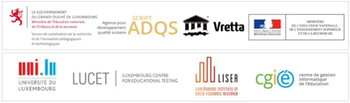
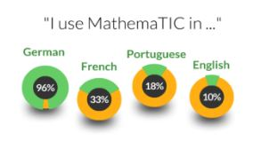

The Ministry of National Education, Children and Youth of the Grand Duchy of Luxembourg signs a convention with Vretta to extend the development and generalization of [MathemaTIC](http://www.mathematic.lu/) for students in Cycle 3 (equivalent to Grades 3 & 4) and Grades 7 & 8. This is in support of the “[Digital Lëtzebuerg](http://www.ftthcouncil.eu/documents/Interviews/20152909_InterviewXavierBettel_FTTHCE.pdf)” strategy announced by Prime Minister Xavier Bettel in October 2014, under the leadership and guidance of Education Minister, Claude Meisch, the Director of SCRIPT, Luc Weis, and the Coordinator of the Project, Amina Afif.

icme
Left to Right: Amina Afif, Head of Division SCRIPT-ADQS; Minister Claude Meisch, Minister of Education; Anand Karat, President-Vretta; Luc Weis, Director-SCRIPT

During the 2015-2016 school year, MathemaTIC for Cycle 4 (Grades 5 & 6) was piloted in 41 participating schools in Luxembourg. The MathemaTIC team developed interactive learning and assessment modules aligned to the mathematical competencies outlined in the national curriculum document for Cycle 4, covering levels 8-10.

“MathemaTIC is a national digital transformational project of high importance and over the past 12 months we were very happy to see our teachers embrace this new personalized learning platform and use it effectively to support the learning of mathematics for students in class and at home. It is with passion that we look forward to supporting our teachers and partners for the generalization of MathemaTIC for Cycle 4 and the development and generalization of MathemaTIC for Cycle 3 and Grades 7 & 8 for all the schools in our country” mentioned Education Minister Claude Meisch.

In order to ensure the highest quality, MathemaTIC has been carefully tailored to meet the specific needs of students, and this has been achieved through a close collaboration and partnership with pedagogy, technology and research experts from the following organizations:

icme
“I am thankful to the immense support that we received from our national and international content experts, teachers, technology partners, research and evaluation specialists, and all the others team members who collaborated with unwavering commitment to achieve the highest possible quality and innovation through the development of the interactive items and customization of the MathemaTIC platform for our students” mentioned Amina Afif, Coordinator of the Project. She continued to say “I also extend a warm welcome to our new team members on the development and customization project for Cycle 3 and Grades 7 & 8 students”.

The strong uptake of MathemaTIC, in the first year of its launch in Luxembourg, can be attributed to the proven innovative pedagogies that have been developed, the ease of use, and the on-demand availability icmeof the platform. MathemaTIC also has the advantage of offering students the ability to dynamically switch between four different languages, covering the entire student population. They can choose to learn in German, French, Portuguese, or English, interchangeably. The majority of students in the Cycle 4 pilot reported that they used the platform in German (96%) with smaller percentages indicating that they also use MathemaTIC in French (33%), Portuguese (18%) and English (10%). The result of the pilot for Cycle 4 students has strengthened the need to not only provide students with interactive diagnostic and summative assessments but also engage them through the learning process throughout the school year. This is based on technology simulations of real-world scenarios to connect abstract math concepts to practical applications, demystifying the subject. “MathemaTIC is the result of pedagogical research conducted by international subject matter experts over many years of validating assessment items. It is also the culmination of almost seven years of educational technology research by Vretta in building and validating interactive Assessment for Learning technologies at schools and post-secondary institutions around the world” mentioned Anand Karat, President of Vretta Inc. He added “internationally, numerous educators have shown keen interest in providing MathemaTIC to their students and we are collaborating with MENJE make MathemaTIC available in countries across Europe”.

To learn more and participate in the [MathemaTIC](http://www.mathematic.lu/) project visit www.mathematic.lu or send an email to info@mathematic.lu.
