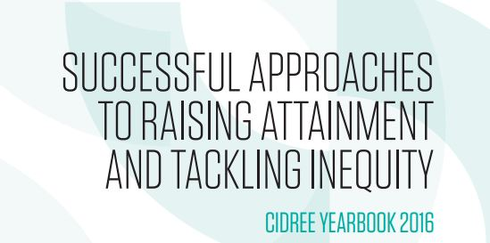

MathemaTIC's [Amina Afif](https://www.linkedin.com/in/amina-afif-31426a9?authType=NAME_SEARCH&authToken=Vgh6&locale=en_US&trk=tyah&trkInfo=clickedVertical%3Amynetwork%2CclickedEntityId%3A27513664%2CauthType%3ANAME_SEARCH%2Cidx%3A1-1-1%2CtarId%3A1452549185273%2Ctas%3AAmina%20Kafa%C3%AF-Afif) and [Jos Bertemes](https://lu.linkedin.com/in/jos-bertemes-9b02291b) have authored an article in the 2016 Yearbook published by the Consortium of Institutions for Development and Research in Education in Europe (CIDREE), which describes the approaches of MathemaTIC for reducing the equity gap and raising attainment for learners.

This article briefly presents the potential of MathemaTIC to improve learning, addresses the conditions necessary for its success, outlines the strengths and challenges encountered during its implementation after a one-year pilot phase, and touches upon the first lessons learnt to inform the next steps of the project.

It specifically answers key questions like:

Why MathemaTIC?
Why is MathemaTIC unique?
How does MathemaTIC work?
What conditions enable MathemaTIC to be a success?

[Click here to read the aritcle by Amina Afif and Jos Bertemes.](http://vrettamedia.s3.amazonaws.com/Course%20Files/YB_16_Inequity.pdf)

[Click here to read the entire Yearbook 2016.](http://www.cidree.org/fileadmin/files/pdf/publications/YB_16_Inequity.pdf)

