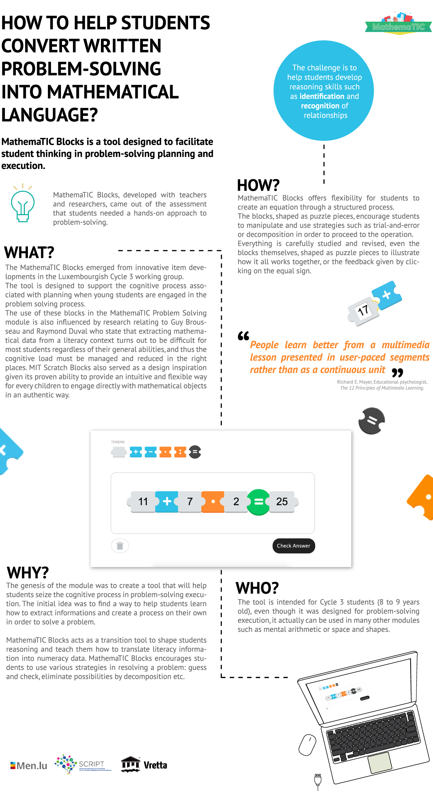

### MAKING PROBLEM-SOLVING INTUITIVE & FUN FOR 8 & 9 YEAR OLD STUDENTS

MathemaTIC Blocks, developed with teachers and researchers, came out of the assessment that students need a hands-on approach to problem-solving. This interactive tool offers flexibility for students to create an equation through a structured process. It helps students develop reasoning skills such as identification and recognition of relationships.

If you'd like to access MathemaTIC Blocks, email [info@mathematic.lu](mailto:info@mathematic.lu).

Click [here](https://vrettamedia.s3.amazonaws.com/MathemaTIC_Blocks.pdf) to download the PDF
