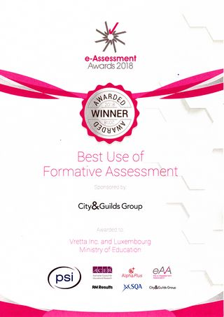

Vretta, alongside the Luxembourg Ministry of National Education, have been awarded the Best Use of Formative Assessment at the second international e-Assessment Award Ceremony for MathemaTIC.

The e-Assessment Award is an international program dedicated to the advancements in e-Assessments and to applauding the latest innovations throughout the education sector. With an increasingly high number of applicants and attention from around the globe, the e-Assessment Award is fast becoming one of the most talked about awards in the education industry. The highly sought after Best Use of Formative Assessment Award, was awarded to MathemaTIC for its innovative approached to large-scale formative assessments and its success in schools throughout in Luxemburg.

The success of MathemaTIC as a personalized learning platform can be attributed to its diagnostic assessments exercises and tests, ease of use, on-demand availability, and dynamic multi-lingual capability.

Established during Luxembourg’s Digital Education Initiative in 2015, MathemaTIC’s successful implementation across Luxembourg continues to show the importance of personalized and adaptive learning environments in helping students achieve confidence and success in mathematics.
