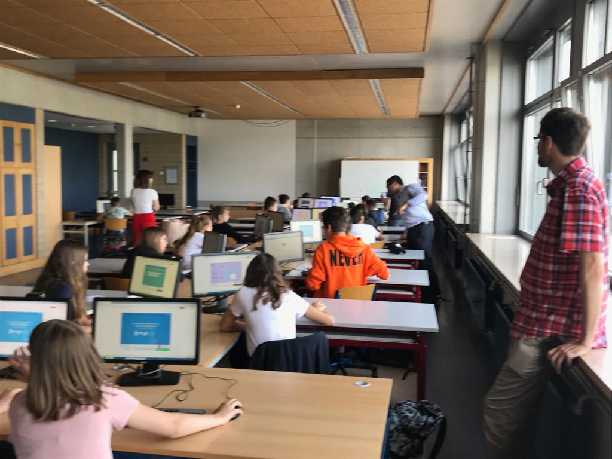
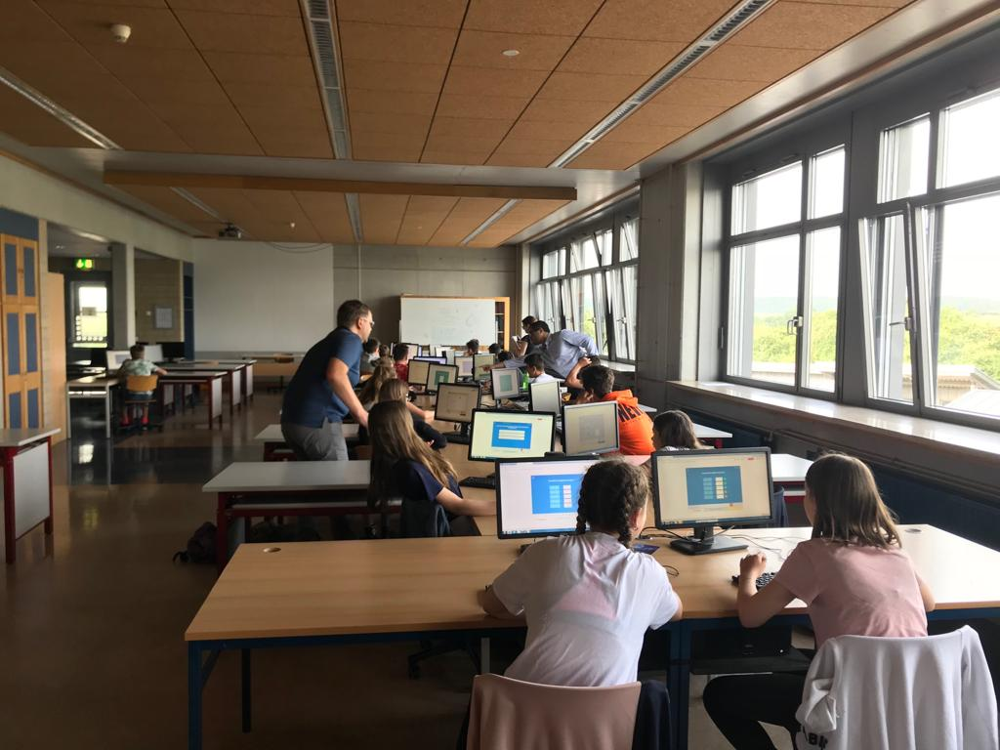
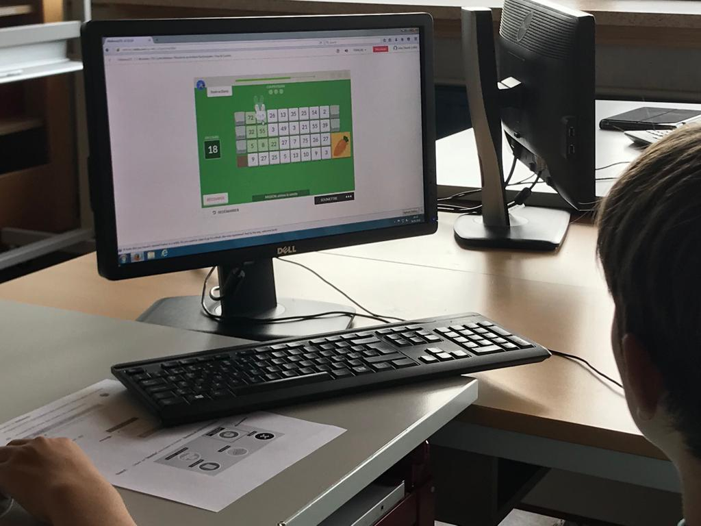
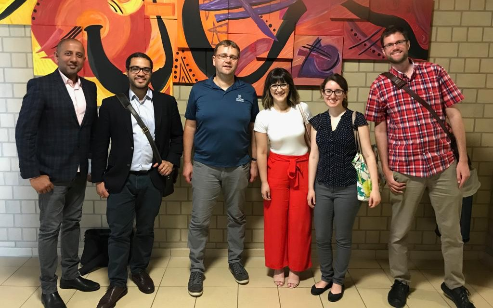

With over 14 years of teaching mathematics to students in Grade 7 and 8 in Luxembourg, Yvan Kieffer has been committed to discovering methods to help his students engage and have fun learning mathematics. For the past two years, he has had the opportunity to work closely with other teachers from Luxembourg who have been part of the MathemaTIC project to design and develop interactive, voice-enabled resources to enhance math education for students.

On June 6th, 2018, Yvan invited the MathemaTIC learning technology team from Canada (Anand Karat, Charles Anifowose, Arbana Miftari, Angelica Mendaglio, and Jeremy Moshe from Vretta) to see how his students in his Grade 7 class (classic) use MathemaTIC to learn fractions.

The class started at 8:30 am and the 22 students, from diverse backgrounds, seemed quite eager to get on the platform. With the technical ability to choose a language to work on, 13 students preferred working on MathemaTIC in German, 7 in French, and 2 in English.

Prior to the class, Yvan assigned the fraction module, using the Agenda feature, for students to complete. Students also continued to have access to the other modules if they wished to move to another topic after completing the assigned work.

“It was nice to see students independently choosing items within the module based on their level of comfort and working through them at their own pace” commented Yvan. He added “the animations and interactions make it fascinating for my students. At times, I work through the modules in front of the entire class and it motivates my students to progress through the items on their own. They try different methods of solving problems and they practice on their own or in groups. It is a great pleasure to see my students having fun with math. MathemaTIC has become part of their overall learning process.”.

After one hour of learning fractions using MathemaTIC, here’s what a few students had to say about their experience:

Student 1: “This tool is making me understand mathematics fast. I like that every time I get something wrong, I get an explanation. When I am learning for a test, I use MathemaTIC in French, but when I am learning for fun, I use it in English. I am happy that we have this platform to use!”

Student 2: “I like working through the red items in MathemaTIC and I enjoy collecting stars - I keep trying till I get all the stars! I also use the calculator tool a lot. Switching between languages in case I don’t understand a specific word works well for me.”

Student 3: “My favourite thing about MathemaTIC is that it is fun! I usually learn on my own and I like playing the math games, collecting stars, and learning in the process.”

The team from Vretta mentioned that it was truly fulfilling to see every student engage with the interactive tools and games that have been carefully designed and developed through creative processes. It was also interesting to see a good mix of students who were working on their own and also in groups with a lot of enthusiasm and focus.

This experience reinforced MathemaTIC as a platform that not only enhances learning but also provides critical 21st century skills for all students.

[Download This Article](https://s3.amazonaws.com/vrettamedia/mathematic_gatsby/news/6/school_visit.pdf)
