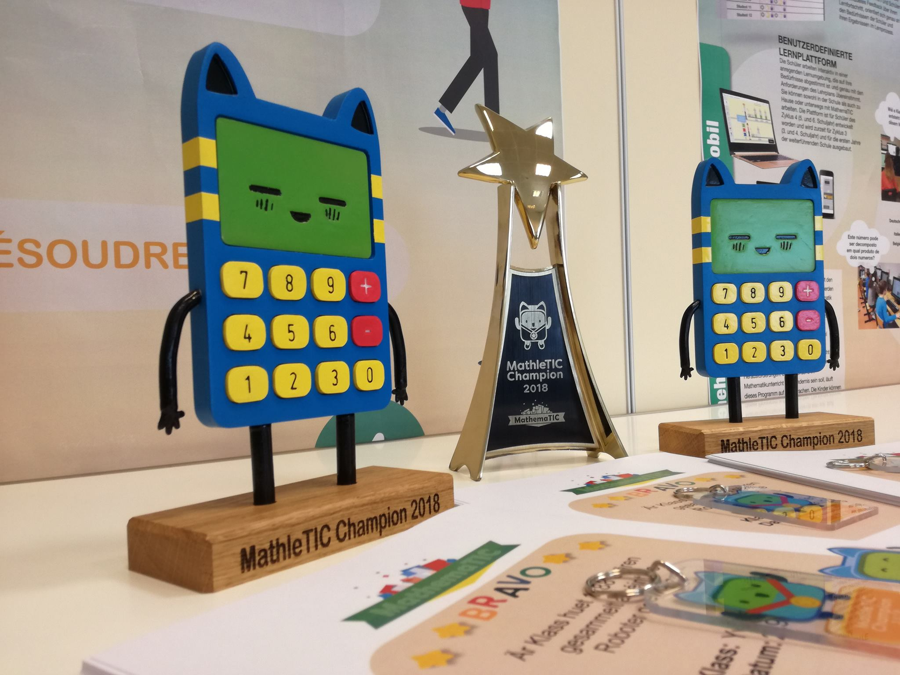
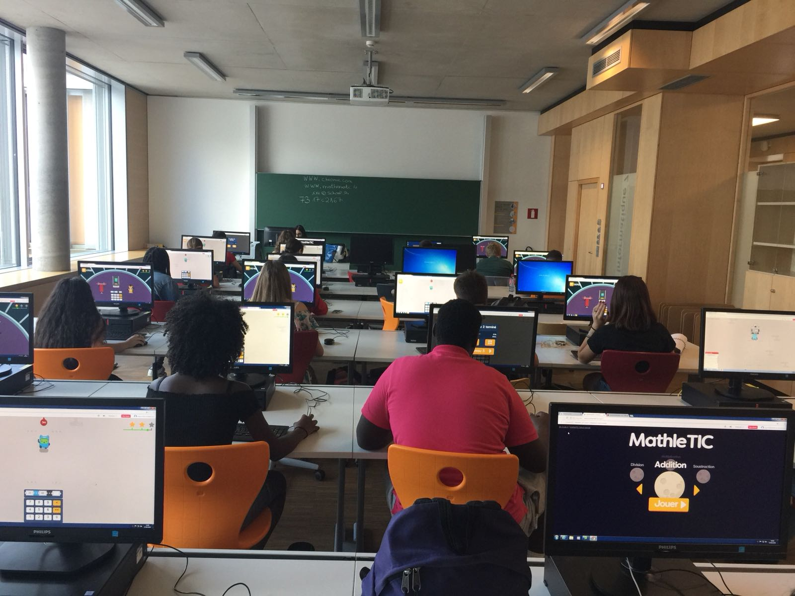

The annual mental math competition, MathleTIC, held by the Luxembourg Ministry of Education and Vretta, makes mastering mental mathematics fun and exciting for students across the nation.

The second annual **MathleTIC** competition was successfully held in Luxembourg from June 27th to the 29th for students from ages 9 to 14 across the country. This friendly competition, led by the Luxembourg Ministry of Education as part of the Digital Luxembourg project - [MathemaTIC](https://www.mathematic.org/), was created to improve students’ mental math skills in four key areas: addition, subtraction, multiplication, and division. The competition was designed to encourage, motivate, and invite all teachers and students to learn and experience an engaging and exciting method of sharpening their mental math skills.

  

This game-based, mental math activity enables students to compute answers to arithmetic operations in order to make the MathleTIC mascot run away from the pursuing space robot! Students collect stars, up to three per level, as they successfully progress through MathleTIC.

All participating classes received certificates of achievement, and champions in mental math received MathleTIC trophies and MathleTIC keychains.

The success of the competition has shown that mathematics, when presented in an engaging, goal-oriented, and personalized environment, motivates students to master concepts with minimal supervision - a truly individualized learning experience for every learner!

MathemaTIC will be welcoming students back to school, at the start of the 2018-2019 academic year, with another friendly competition to prepare them for the year ahead!

To learn more about how you can make mental math fun for your students, reach out to us at [info@mathematic.org](mailto:info@mathematic.org) for access to MathleTIC.
