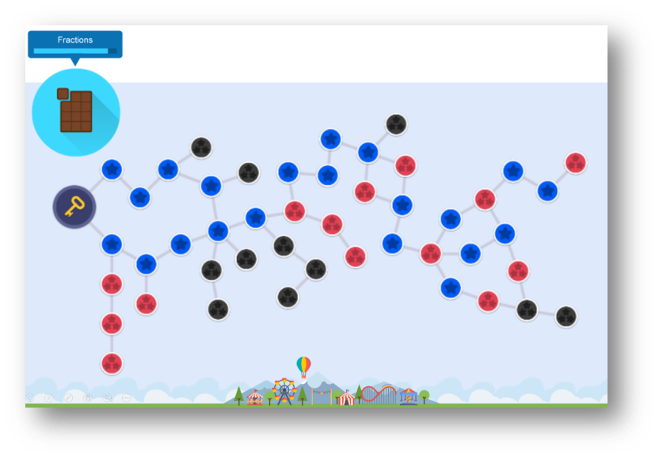
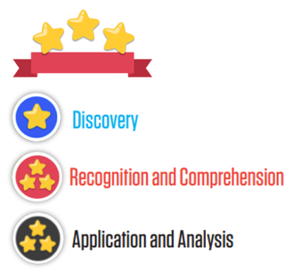

July marked the month when the [MathemaTIC](http://mathematic.lu/team.html) team launched a series of interactive learning and assessment items that are designed to make fractions engaging and fun for students.

_Fractions_ is a key foundational mathematical concept and in order to properly support students in mastering it, MathemaTIC provides them with a personalized learning environment to succeed at their own pace.

With 46 unique discovery items, recognition and comprehension items, and application and analysis items, students work through a carefully tailored interactive module map that provides them with the required scaffolding to move towards a stronger understanding of fractions.

A comprehensive diagnostic assessment identifies students’ areas of improvements and provides them with the guidance to work through the items. As items are completed, stars are collected based on the students’ performance. This has shown to keep students engaged and motivated through the learning process.

### Building the Foundation for Success

In the early stages of the module, students complete **discovery items** through an interactive learning experience where they learn key concepts. These include: representing fractions visually, equivalent fractions, and performing the four arithmetic operations with fractions.

  

Students are taught these concepts in an adaptive environment that progresses with their level of comprehension; increasing in complexity as they demonstrate their understanding. As they progress, their foundational knowledge of fractions develops and they become more comfortable with the necessary concepts and skills.

### Applying Knowledge and Honing Skills

  

In order to ensure students have attained a practical knowledge of fractions, the module contains **_recognition and comprehension_** items in which they apply the skills that they have just learned in specific scenarios.

These items are strategically integrated in the module map so that students can complete them before progressing to more challenging lessons and exercises. These items are crucial in bridging the gap between the knowledge of fractions that the students have acquired and their ability to recognize and comprehend the use of fractions in practical situations.

### Transforming Knowledge to Practical Problem Solving

A students’ mastery of fractions is only as useful as their ability to apply their knowledge in practical scenarios. In the later stage of the module, students are given access to **_application and analysis items_** that are both problem solving and game-based in nature.

These items are designed to allow students to apply their knowledge in varying scenarios and give them autonomy on how to approach each situation.

The problem solving items require students to leverage their previously acquired knowledge of fractions, but also requires them to determine which concepts to use and how they should be applied.

  

By focusing on practical, real-world, scenarios, this module presents students with an engaging way to develop their fractions ability.

  

In conjunction with the problem solving items, students also have access to various gamebased items, which provide another avenue for them to apply their skills.

By using game-based items, the module lets students work in a goal-oriented environment that makes improving and mastering their fractions fun and engaging.

For example in the Mahjong item, students apply their knowledge of simplifying and matching fractions, in an engaging and gamified way, that also promotes problem solving.

### Interactive Tools: Personalizing the Learning Environment

As with every MathemaTIC module, the fractions module hosts a variety of interactive tools which provide an additional layer of personalization to the students’ learning experience.

  

There are three brand new tools that students can leverage throughout this module. These include the Fraction Tool, which allows students to visually represent fractions within a segmented line, the Multi-Tool, which gives students the ability to simplify, amplify, and visualize operations of, multiple fractions, and the Counter Tool, which helps students determine common multiples between a set of numbers.

These tools give students a multitude of methods of approaching any question and supports the engaging and personalized learning experience that this module, and the rest of MathemaTIC, fosters.

The Fractions module marks an impressive achievement for the MathemaTIC team. With 46 different items that teach, elevate, and test students’ knowledge and ability in fractions, this module is the second largest to come from MathemaTIC.

To provide your students with access to MathemaTIC to help them master fractions, reach out to us at [info@mathematic.org](mailto:info@mathematic.org).
